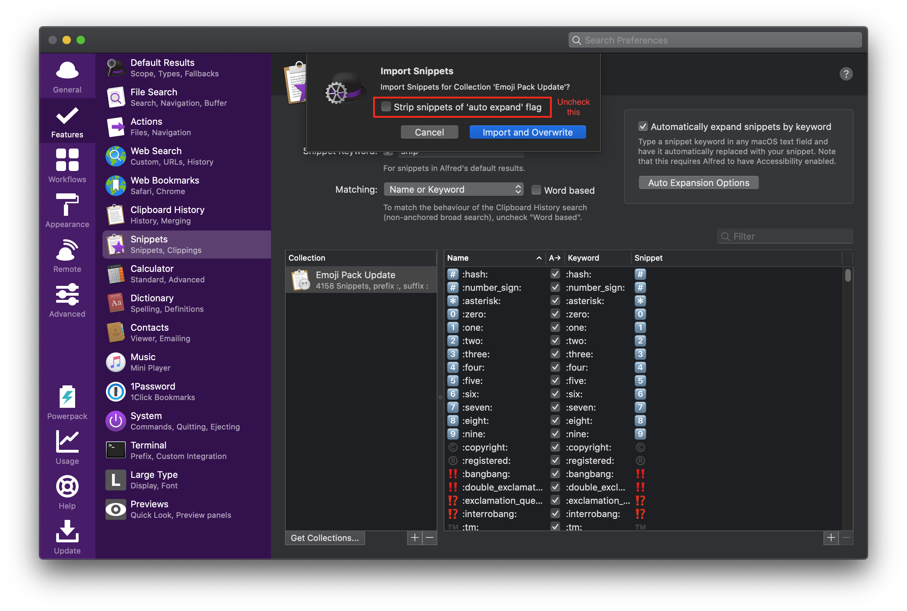
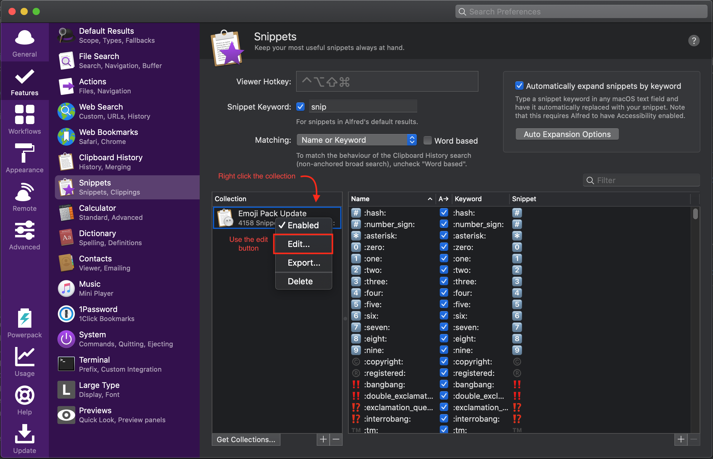
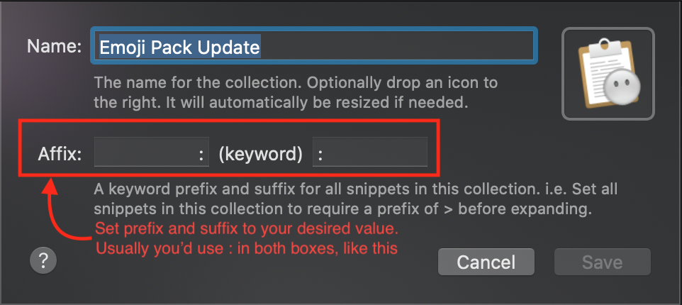

# Alfred Emoji Pack Update

This is an updated version of the original alfred emoji pack to include new emojis in unicode 12.
Even if the script was written quickly, it is now more useable, and supports I18N.

## Important links

* See `snippets/` for the pre-generated file
* The original emoji pack and instructions are available here: https://github.com/califa/alfred-emoji-pack
* Emojis are downloaded from EmojiBase: https://github.com/milesj/emojibase - https://cdn.jsdelivr.net/npm/emojibase-data@latest/en/

## Install

1. Download the [generated snippets file](https://github.com/paris-ci/Alfred-Emoji-Pack-Update/raw/master/snippets/Emoji%20Pack%20Update.alfredsnippets)
2. Import them into alfred, **uncheck the** strip snippets of auto-expand flag checkbox.
   
3. Set your desired prefix and suffix by right clicking the collection in the snippets view:
    1. Edit the collection 
    2. Set your prefix and suffix 
    3. If you don't plan to use a suffix, then download and install the [alternative snippets file](https://github.com/paris-ci/Alfred-Emoji-Pack-Update/raw/master/snippets/Emoji%20Pack%20Update%20Deduped.alfredsnippets) to avoid shorter keywords overriding the longer compound ones (`+1` becomes `+1␣` to allow entering `1_tone1`)
4. Enjoy ! 